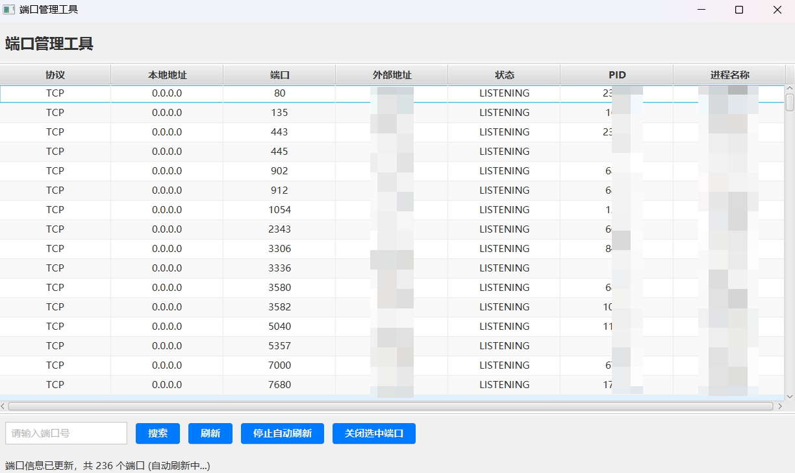

# 🚀 PortManager - 端口管理工具

<div align="center">


一个 Windows 端口管理工具，提供实时端口监控、进程管理和智能搜索功能。我在开发过程中，经常会发现，某些端口被占用，但是没有对应的进程，或者进程被终止，但是端口没有释放。然后去终端使用`netstat -ano`命令，但是每次都要输入端口号，效率太低。于是就写了这个项目。

[功能特性](#-功能特性) • [快速开始](#-快速开始) • [使用说明](#-使用说明) • [技术栈](#-技术栈) • [贡献指南](#-贡献指南)

</div>

## 📸 界面预览



## ✨ 功能特性

### 🔍 **实时端口监控**

- 📊 实时显示系统所有占用端口
- 🔄 **5 秒无感自动刷新**，保持数据最新
- 📱 支持 TCP 和 UDP 协议
- 🌐 完整支持 IPv4 和 IPv6 地址

### ⚡ **智能搜索**

- 🔎 按端口号快速搜索
- 📋 实时过滤显示结果
- 🎯 精确匹配端口信息

### 🛠️ **进程管理**

- 👀 显示占用端口的进程信息
- ⚠️ 安全终止选中进程
- 🔒 确认对话框防止误操作

### 🎨 **用户体验**

- 🖥️ 现代化 JavaFX 界面
- 📊 表格式数据展示
- 🔄 边扫描边显示，无需等待
- 💾 保持用户选择状态

## 🚀 快速开始

### 📋 系统要求

- **操作系统**: Windows 10/11
- **Java 版本**: JDK 11 或更高版本
- **Maven 版本**: 3.6 或更高版本

### 📦 安装步骤

1. **克隆项目**

```bash
git clone https://github.com/yourusername/PortManager.git
cd PortManager
```

2. **编译项目**

```bash
mvn clean compile
```

3. **运行应用**

```bash
mvn exec:java
```

或者打包后运行：

```bash
mvn clean package
java -jar target/port-manager-1.0.0.jar
```

## 📖 使用说明

### 🎮 基本操作

1. **启动应用**: 运行后自动扫描并显示端口信息
2. **搜索端口**: 在搜索框输入端口号，点击"搜索"
3. **刷新数据**: 点击"刷新"按钮手动更新端口信息
4. **终止进程**: 选中端口后点击"关闭选中端口"

### ⚙️ 自动刷新

- **默认启用**: 应用启动后自动开启 5 秒刷新
- **手动控制**: 点击"停止自动刷新"/"启动自动刷新"切换
- **无感更新**: 自动刷新时保持界面状态，不打断用户操作

### 🔍 搜索功能

- 输入端口号进行精确搜索
- 清空搜索框显示所有端口
- 搜索结果实时更新

## 🛠️ 技术栈

| 技术       | 版本     | 用途         |
| ---------- |--------| ------------ |
| **Java**   | 11+    | 核心开发语言 |
| **JavaFX** | 17.0.1 | 用户界面框架 |
| **Maven**  | 3.6+   | 项目构建管理 |
| **FXML**   | -      | 界面布局描述 |

### 📁 项目结构

```
PortManager/
├── src/main/java/com/portmaster/
│   ├── MainApplication.java          # 应用程序入口
│   ├── controller/
│   │   └── MainController.java       # 主控制器
│   ├── model/
│   │   └── PortInfo.java            # 端口信息模型
│   └── util/
│       ├── PortScanner.java         # 端口扫描工具
│       └── ProcessKiller.java       # 进程终止工具
├── src/main/resources/
│   ├── com/portmaster/
│   │   ├── main.fxml               # 主界面布局
│   │   └── icon.png                # 应用图标
│   └── css/
│       └── main.css                # 样式表
├── pom.xml                         # Maven配置
└── README.md                       # 项目说明
```

## 🔧 核心功能实现

### 端口扫描

- 使用`netstat -ano`命令获取端口信息
- 支持中文 Windows 系统输出解析
- 实时回调机制，边扫描边显示

### 自动刷新

- 基于`ScheduledExecutorService`的定时任务
- 智能数据更新，保持用户界面状态
- 可配置刷新间隔（当前 5 秒）

### 进程管理

- 集成`tasklist`和`taskkill`命令
- 安全的进程终止确认机制
- 详细的进程信息显示

## ⚠️ 安全提醒

- 🔐 **管理员权限**: 建议以管理员身份运行以确保功能正常
- ⚠️ **谨慎操作**: 终止进程可能导致应用程序异常关闭
- 🛡️ **确认机制**: 所有危险操作都有确认对话框

## 🤝 贡献指南

我们欢迎所有形式的贡献！

### 🐛 报告问题

- 使用[Issues](https://github.com/yourusername/PortManager/issues)报告 bug
- 提供详细的错误信息和复现步骤

### 💡 功能建议

- 在 Issues 中提出新功能建议
- 详细描述功能需求和使用场景


## 📄 许可证

本项目采用 MIT 许可证 - 查看[LICENSE](LICENSE)文件了解详情。

## 🙏 致谢

- 感谢 JavaFX 社区提供的优秀 UI 框架

## 📞 联系方式

- **项目主页**: [GitHub Repository](https://github.com/yourusername/PortManager)
- **问题反馈**: [Issues](https://github.com/yourusername/PortManager/issues)
- **邮箱**: jingshuihuayue@qq.com
